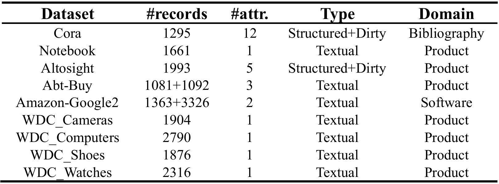

## uB-CL

---

Paper: Contrastive Learning-based Unsupervised Blocking in Entity Resolution

The repository contains the implementation of all components of the uB-CL framework, including model training, record embedding, and block generation.

### 1.Installation

The requirements.txt file contains the environment needed to run the code.

```python
pip install -r requirements.txt
```

### 2.Datasets

Public datasets used in the paper are from [DeepMatcher](https://github.com/anhaidgroup/deepmatcher/blob/master/Datasets.md), [WDC](http://webdatacommons.org/largescaleproductcorpus/v2/) and 
[2022 SIGMOD Programming Contest](http://sigmod2022contest.eastus.cloudapp.azure.com). The cora dataset is in the data folder.



### 3. How to use

#### Model Training

##### Dataset Construction

The dataset is divided into three types, with complete examples provided in the `data` folder:

- `./data/toy_back_trans.csv`: Designed specifically for back translation.
- `./data/toy_da.txt`: Designed for data augmentation without hard negatives or back translation.
- `./data/toy_hard_neg.json`: Designed for hard negatives.

Before training, ensure the dataset is converted to the corresponding format.

##### Training Example

Below is an example of training parameters:

```bash
python run.py \
  --model_name_or_path "model_name_or_path" \
  --train_file "dataset_file" \
  --max_seq_length 128 \
  --grouped_size 10 \
  --pool_type "cls" \
  --use_sparse \
  --loss_type "adaptive" \
  --preprocessing_num_workers 4 \
  --output_dir "./result" \
  --num_train_epochs 5 \
  --per_device_train_batch_size 32 \
  --learning_rate 5e-5 \
  --logging_dir "./logs" \
  --logging_steps 100 \
  --save_steps 500 \
  --evaluation_strategy "steps" \
  --eval_steps 500 \
  --lambda_learning_rate 0.01 \
  --hard_negative \
  --delete_word \
  --delete_word_probability 0.2 \
  --swap_word \
  --swap_word_probability 0.3 \
  --replace_word True \
  --replace_word_probability 0.2 \
  --hnsw_index "hnsw file" \
  --word2vec_model "word2vec model file"
```

- `use_sparse`: Enables sparse vectors.
- `hard_negative`: Enables hard negatives; use a dataset designed specifically for hard negatives.
- `grouped_size`: Uses `grouped_size-1` negative samples.

For more details on parameters, refer to the `arguments.py` file.

---

#### Embedding Recording

The embedding recording files are located in the `get_embedding` folder, designed for SBERT. 

- **`double`**: Indicates a dual-source dataset.
- **`single`**: Indicates a single-source dataset.
- **`dense_sparse`**: Generates both dense and sparse representations.

To record embeddings, simply add the model path to the `embedding_model = []` list.

---

#### Block Generation

The block generation files are located in the `block_generation` folder. 

To generate blocks, add the embedding storage path to `DR_methods = []`.

---

#### Additional Tools

- **Back Translation**: The `back_trans` folder contains code for back translation. Modify the input and output files as needed.
- **Word Replacement**: The `replace_word` folder contains code for training Word2Vec models and generating HNSW indices. Modify the corresponding training files as needed.
